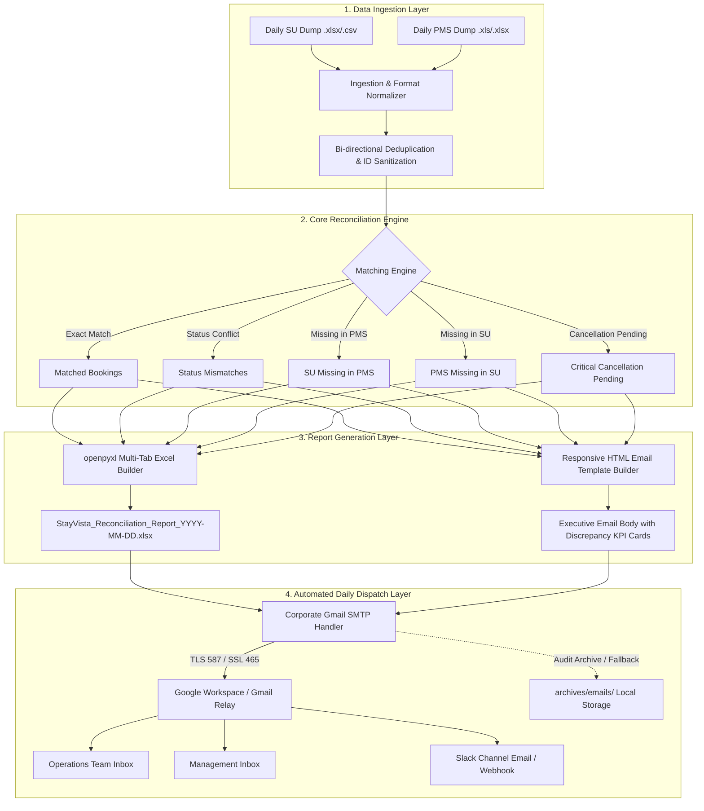

# StayVista Automated Reconciliation Engine
## System Requirements & Daily Process Execution Flow Specification

**Document Version:** 1.0.0  
**Target Environment:** Production / Staging  
**Author:** Senior Software Developer & DevOps Engineering Lead  
**Scope:** Automated Daily Ingestion, MIS Reconciliation Engine, Excel Generator & Corporate Gmail SMTP Dispatcher

---

## 1. Executive Summary & Objective

The objective of this engineering implementation is to establish a fully automated, resilient, and zero-cost daily pipeline that:
1. Ingests daily Source of Truth (SU) booking dumps and Property Management System (PMS) reports (including corrupted BIFF8 `.xls` and standard `.xlsx` files).
2. Executes multi-tier automated cross-referencing to isolate mismatches, missing reservations, and critical **Cancellation Pending** operational items.
3. Compiles an executive, styled multi-tab Excel workbook (`.xlsx`) containing 8 operational categories.
4. Automatically broadcasts the summary HTML alert and attaches the workbook via **Corporate Gmail / Google Workspace SMTP** to a designated list of operations, finance, and leadership emails every single day without manual intervention.

---

## 2. End-to-End Architecture & Data Flow



---

## 3. Technical Requirements

### 3.1 SMTP Specifications (Google Workspace / Company Gmail)
| Parameter | Value | DevOps Rationale |
| :--- | :--- | :--- |
| **SMTP Host** | `smtp.gmail.com` | Google Workspace corporate relay endpoint |
| **SMTP Port** | `587` (STARTTLS) or `465` (SSL) | Port 587 with STARTTLS is recommended for standard firewall traversal |
| **Authentication** | Google App Password (16 characters) | 2FA-compliant machine authentication; bypasses interactive Google OAuth login |
| **Sender Account** | Common Company Gmail / Service Account | Centralized corporate identity (e.g. `reconciliation@stayvista.com`) |
| **Sender Display Name** | `StayVista Reconciliation Engine` | Identifiable sender header to avoid spam/phishing classification |
| **MIME Structure** | `multipart/mixed` with `text/html` + attachment | Ensures high-fidelity HTML rendering across Apple Mail, Outlook, and Gmail |
| **Attachment Type** | `.xlsx` (`application/vnd.openxmlformats-officedocument.spreadsheetml.sheet`) | Unrestricted multi-tab binary Excel file |

### 3.2 Security & Compliance Directives
1. **Never use personal email accounts**: All notifications must originate from an official organizational email.
2. **Never commit credentials to Git**: The `.env` file is excluded in [`.gitignore`](file:///Users/omeshwarshukla/STAYVISTATOOLS1KUSHAL/.gitignore). Use environment variables in cloud/container runners.
3. **Fail-Safe Dry-Run Archiving**: If SMTP credentials ever fail or are invalid, the engine **never crashes silently**; it writes the complete HTML email and multi-sheet Excel file to [`archives/emails/`](file:///Users/omeshwarshukla/STAYVISTATOOLS1KUSHAL/archives) for audit and manual retrieval.

---

## 4. Configuration Template (Copy-Paste Section)

To configure your corporate Gmail account, populate [`.env`](file:///Users/omeshwarshukla/STAYVISTATOOLS1KUSHAL/.env) in the project root:

```env
# =====================================================================
# STAYVISTA CORPORATE GMAIL SMTP SETTINGS
# =====================================================================
SMTP_HOST=smtp.gmail.com
SMTP_PORT=587
SMTP_USE_TLS=True

# 1. Company Sender Email Address (e.g., ops-alerts@stayvista.com or corporate gmail)
SMTP_USER=YOUR_COMPANY_GMAIL_HERE@stayvista.com

# 2. Google 16-Character App Password (Generated via myaccount.google.com/apppasswords)
SMTP_PASSWORD=xxxx xxxx xxxx xxxx

# 3. Friendly Sender Name
SMTP_FROM_NAME=StayVista Reconciliation Engine

# 4. Target Recipient Email List (Comma-separated)
# All addresses below receive the same comprehensive report and Excel attachment
RECIPIENT_EMAILS=operations@stayvista.com, finance@stayvista.com, omeshwar.shukla@stayvista.com

# =====================================================================
# FOLDER WATCHER CONFIGURATION
# =====================================================================
WATCH_FOLDER=data/incoming
PROCESSED_FOLDER=data/processed
POLL_INTERVAL_SECONDS=5
```

### How to Generate the Google App Password:
1. Log in to the company Google account: [Google App Passwords Portal](https://myaccount.google.com/apppasswords).
2. Enter an app name: `StayVista Daily Reconciliation`.
3. Click **Create**. Google displays a 16-character code (e.g. `abcd efgh ijkl mnop`).
4. Paste this code directly into `SMTP_PASSWORD` in your `.env`.

---

## 5. Daily Process Execution Flow

### Stage 1: Ingestion & Input Triggering
There are three deployment methods to run the daily reconciliation:

#### Method A: Automated Cron Schedule (Recommended for Production / Cloud / Dedicated Server)
Configure a daily cron job to run at 08:30 AM every morning:
```bash
# Open crontab editor
crontab -e

# Add daily 8:30 AM trigger (Adjust path to your actual repository directory)
30 8 * * * cd /Users/omeshwarshukla/STAYVISTATOOLS1KUSHAL && ./venv/bin/python backend/run_automation.py --once >> archives/automation.log 2>&1
```

#### Method B: Continuous Incoming Folder Watcher Daemon (Ideal for Local / Office Desktops)
Run the persistent background daemon that watches `data/incoming/`:
```bash
python backend/run_automation.py --watch
```
*Workflow:*
- User drops morning files (`SU_Dump.xlsx` and `PMS_Query.xls`) into `data/incoming/`.
- Within 5 seconds, the engine detects both files, reconciles them, moves them to `data/processed/`, generates the styled Excel workbook, and automatically dispatches the email to all recipients.

#### Method C: On-Demand via Web Dashboard or CLI
- **CLI**:
  ```bash
  python backend/run_automation.py --files data/incoming/SU_Dump.xlsx data/incoming/PMS_Report.xls
  ```
- **Web UI**: Click the **Email Automation** button in the top navigation bar of the web dashboard, enter custom recipients if desired, and click **Dispatch Now**.

---

### Stage 2: Processing, Reconciliation & Excel Formatting
1. **Sanitization**: Leading zeros normalized (`00170536542` -> `170536542`), timestamps stripped, OTA channel names standardized (`MMT`, `AIRBNB`, `BOOKING_COM`, `AGODA`).
2. **Cross-Referencing**:
   - `Cancellation Pending`: Reservations active in PMS but marked cancelled in SU or with cancellation requests.
   - `Confirmed SU / Cancelled PMS`: Risk of guest arrival with canceled room status.
   - `Missing in PMS`: Potential booking loss / untracked revenue.
   - `Missing in SU`: Walk-in or untracked direct reservation.
   - `Base vs Query Mismatch`: PMS internal synchronization lag.
3. **Excel Generation (`openpyxl`)**: Builds a 9-tab corporate-formatted `.xlsx` file with frozen headers, colored KPI status badges, and column auto-sizing.
4. **HTML Body Rendering**: Injects live KPI cards and top critical action items directly into the email body.

---

### Stage 3: SMTP Handshake & Transmission
1. Resolves recipients from `.env` or API request.
2. Initiates TLS handshake on `smtp.gmail.com:587`.
3. Authenticates using `SMTP_USER` and `SMTP_PASSWORD`.
4. Transmits `MIMEMultipart` envelope containing:
   - Formatted HTML body.
   - Attached `.xlsx` file (`StayVista_Reconciliation_Report_YYYY-MM-DD_<batch>.xlsx`).
5. Archives a local copy in `archives/emails/` for compliance and recovery.

---

## 6. Pre-Flight Validation Checklist

Before initiating daily production runs, verify each component:

| Step | Action | Command / Check | Expected Result |
| :--- | :--- | :--- | :--- |
| **1** | Verify `.env` parameters | `cat .env` | `SMTP_USER`, `SMTP_PASSWORD`, `RECIPIENT_EMAILS` populated |
| **2** | Test SMTP credentials | `python backend/run_automation.py --test-email your_email@stayvista.com` | `✔ Office SMTP connection was established and verified successfully!` |
| **3** | Dry-run reconciliation | `python backend/run_automation.py --once` | Exits cleanly, generates archive files in `archives/emails/` |
| **4** | Check Web Portal status | Open Web App → Click **Email Automation** | Shows Green "SMTP Ready" badge with active recipient count |

---

## 7. Operational Runbook & DevOps Troubleshooting

### Issue 1: `smtplib.SMTPAuthenticationError: (535, '5.7.8 Username and Password not accepted')`
- **Cause**: Using regular Gmail account password instead of Google 16-character App Password, or 2-Step Verification is disabled.
- **Resolution**:
  1. Ensure 2-Step Verification is active on the company Google account.
  2. Generate a new App Password at `https://myaccount.google.com/apppasswords`.
  3. Ensure no trailing or leading whitespace is present in `SMTP_PASSWORD`.

### Issue 2: `smtplib.SMTPConnectError` or Connection Timeout
- **Cause**: Port 587 blocked by local network/VPN firewall.
- **Resolution**: Change `SMTP_PORT=465` and verify SSL connection in [`.env`](file:///Users/omeshwarshukla/STAYVISTATOOLS1KUSHAL/.env).

### Issue 3: Daily dump file dropped with corrupted header / BIFF8 format
- **Resolution**: The engine automatically invokes `xlrd` with `ignore_workbook_corruption=True` as fallback to ingest old `.xls` exports without user intervention.
